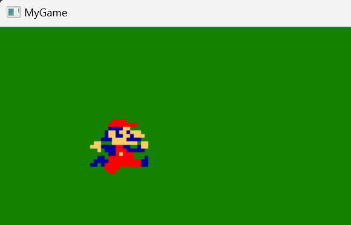

# Mario GUI Game

## Description

This project is a simple mario GUI game. It leverages SDL (Simple DirectMedia Layer) for graphics and user input, follows object-oriented programming principles, includes classes for organized code, and incorporates GUI (Graphical User Interface) elements for an interactive user experience. The primary goal is to demonstrate game development techniques using SDL.

## Technologies Used

- **SDL (Simple DirectMedia Layer):** A cross-platform development library designed to provide low-level access to audio, keyboard, mouse, joystick, and graphics hardware via OpenGL and Direct3D.

- **Object-Oriented Programming (OOP):** The project is structured using OOP principles, which promote code reusability, maintainability, and modularity.

- **Classes:** Multiple classes are employed to encapsulate and organize different aspects of the project, promoting clean and organized code.

- **GUI Development:** The project includes graphical user interfaces (GUIs) to provide users with interactive elements and enhance the overall user experience.

- **Game Development:** The project serves as an example of game development, demonstrating key game design concepts and mechanics using SDL.

## Project Structure

- **`/src`:** Contains the source code files for the project.
- **`/assets`:** Stores any assets (images, sounds, etc.) used in the project.

## License

This project is licensed under the **MIT License** - see the [LICENSE](LICENSE) file for details.